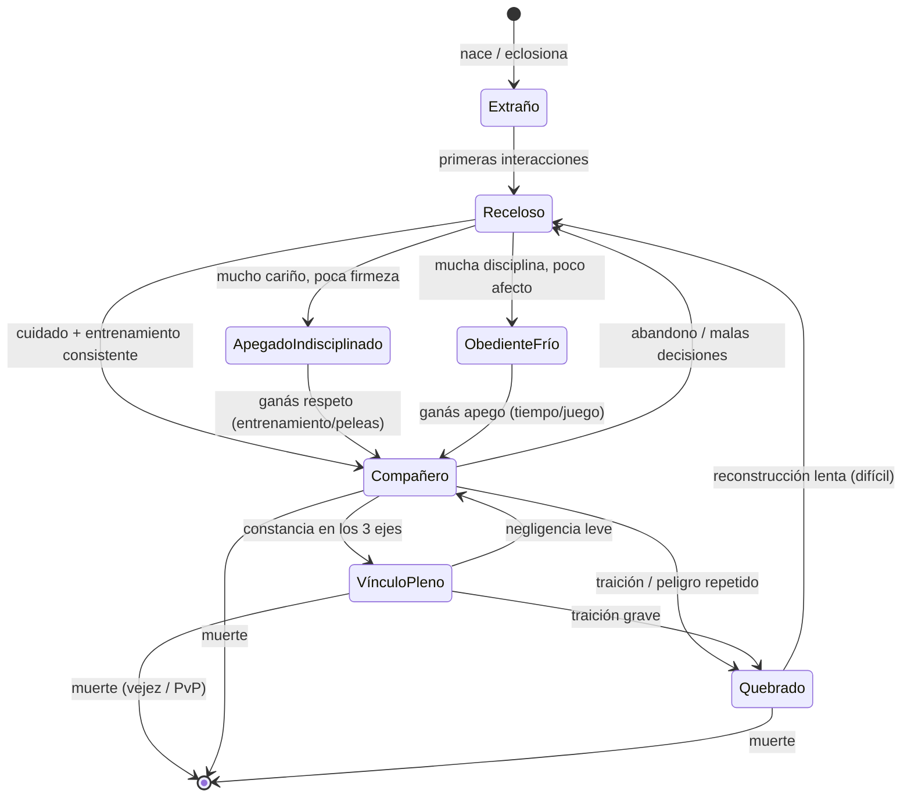

# A3 · Vínculo + obediencia imperfecta
### Entregable de la iteración A3 (v1.0 · **Aprobado**) · *parte de* `Plan-de-Iteraciones.md`

> **Qué es esto:** el corazón del juego. Modela la relación jugador↔dragón **como gameplay, no como una barra**. Define los ejes del vínculo, cómo suben y bajan, el modelo de **obediencia efectiva** (das intenciones, el dragón decide), el diagrama de estados de la relación, y perfiles de ejemplo.
>
> **Depende de:** A2 (aprobado). **Hereda de A2:** el vínculo vive en la **díada** (Capa 4), produce obediencia efectiva, y se cruza con el **temperamento elevado por preparación de combate** (D2) y con el **ánimo** (condición del fenotipo).

---

## Principio de diseño

La obediencia **no es un interruptor**. Das una **intención** ("atacá", "vení", "esperá", "protegé") y el dragón la procesa según *quién sos para él* en ese momento. Puede acatarla, hacerla a medias, dudar, ignorarla, o **hacer otra cosa** siguiendo su propio temperamento. Un dragón poderoso mal vinculado es **peligroso e impredecible**, no una máquina de ganar.

---

## Los tres ejes del vínculo

Son **independientes** — esa independencia es lo que genera los perfiles interesantes. Cada uno gobierna una cosa distinta:

| Eje | Pregunta que responde | Qué gobierna | Sube con | Baja con |
|---|---|---|---|---|
| **Confianza** | *"¿Me vas a lastimar o traicionar?"* | Aceptar órdenes **riesgosas** (meterse al peligro, pelear a muerte). | Cuidarlo, curarlo, sacarlo del peligro a tiempo, cumplir rutinas. | Exponerlo a peligro innecesario, que una orden tuya lo lastime, abandonarlo. |
| **Respeto** | *"¿Sos un líder capaz?"* | Acatar órdenes **en general**, disciplina. | Entrenar con constancia, ganar peleas por buena conducción, firmeza justa, decisiones coherentes. | Órdenes incoherentes, huir, perder por mala conducción, dejarte dominar. |
| **Apego** | *"¿Me importás?"* | El **esfuerzo extra**: te protege, da más de lo pedido, tolera tus errores. | Tiempo compartido, juego, comida preferida, atención (incluida la app companion), superar adversidad juntos. | Abandono prolongado, negligencia, frialdad. |

**Asimetrías (clave para que se sienta vivo):**
- **Confianza:** cae rápido, sube lento. Una traición pesa más que diez cuidados.
- **Respeto:** se gana con **consistencia**; no se compra con un solo gesto.
- **Apego:** decae con la **ausencia** (conecta con el pilar 4 y la app companion).

---

## Moduladores externos al vínculo

La obediencia no sale solo de los tres ejes. Dos factores del dragón la tuercen en el momento:

- **Temperamento** *(de A2/D2 → detalle en A5):* cuanto más **preparado para el combate**, más alto el temperamento → **más resistencia a obedecer**. Un dragón agresivo necesita **más vínculo** para el mismo nivel de obediencia. Poder y control tiran en direcciones opuestas.
- **Ánimo** *(estado transitorio, del fenotipo):* hambre, dolor, miedo, adrenalina, condición física baja. Un dragón asustado o dolorido obedece peor aunque te ame. Es el "ruido" del día a día.

---

## Modelo de obediencia efectiva

Cuando das una intención, se evalúa así (conceptual, no balanceado aún):

```
obediencia(intención) =
      base( Respeto )                         ← ¿acata órdenes en general?
    × apertura_al_riesgo( Confianza, riesgo(intención) )   ← ¿acepta lo peligroso?
    × esfuerzo( Apego )                        ← ¿da el extra?
    − resistencia( Temperamento )              ← poder de combate = más rebeldía
    ± ruido( Ánimo )                           ← miedo/dolor/hambre/adrenalina
```

El resultado cae en un **bucket de respuesta**:

| Resultado | Qué hace el dragón |
|---|---|
| **Acata pleno** | Ejecuta la intención con compromiso. |
| **Acata a medias** | La ejecuta tibia, tarde o incompleta. |
| **Duda** | Se traba, pierde el tempo (costoso en arena). |
| **Ignora** | No hace nada; sigue en lo suyo. |
| **Desvía (autonomía)** | Hace **otra cosa** según su temperamento (ataca por su cuenta, huye, protege sin que se lo pidas). |
| **Se rebela** | Solo en extremos (confianza/respeto colapsados + temperamento alto): se vuelve contra la situación o contra vos. |

**Regla de oro:** las órdenes de **alto riesgo mortal** (mandarlo a un **PvP a muerte**, meterlo en fuego cruzado) exigen **Confianza muy alta**. Un dragón que no confía en vos **se niega a jugarse la vida** por más que te respete — atadura mecánica directa con la permadeath de A1.

---

## Diagrama de estados de la relación

Los tres ejes definen **regiones** por las que la díada transita. No son casillas rígidas: son zonas del espacio (Confianza × Respeto × Apego).



| Estado | Perfil (ejes) | Cómo se juega |
|---|---|---|
| **Extraño** | Todo neutro/bajo | Punto de partida; casi no obedece nada riesgoso. |
| **Receloso** | Confianza baja | Te mide; obedece lo seguro, rechaza lo peligroso. |
| **Apegado indisciplinado** | Apego alto, Respeto bajo | *Te adora pero no te obedece.* Hace lo que quiere. |
| **Obediente frío** | Respeto alto, Apego bajo | Soldado eficiente sin corazón; no da el extra, se va fácil. |
| **Compañero** | Los tres medio-altos | El buen estado jugable; obediencia confiable con fricción. |
| **Vínculo pleno** | Los tres altos | Obediencia casi total, esfuerzo extra, se juega por vos. |
| **Quebrado** | Confianza colapsada | Ruptura; resentido, impredecible. Recuperación lenta y cara. |

---

## Casos de ejemplo (perfiles)

**1. "Te quiere pero no te respeta"** — Apego alto, Respeto bajo, Confianza media.
Te sigue a todos lados y se pone triste si te vas, pero cuando le das una orden de combate hace **lo que a él le parece**. En arena, *desvía* seguido: ataca por impulso en vez de esperar tu comando. Divertido de tener, frustrante de pelear. Se arregla con **entrenamiento constante y firmeza**, no con más mimos.

**2. "El mercenario"** — Respeto alto, Apego bajo, Confianza media.
Obedece impecable en lo táctico, pero es **frío**. No da el esfuerzo extra: si la pelea se pone fea, no se sacrifica por vos. Si aparece un vínculo mejor (o lo descuidás), su apego no lo retiene. Eficiente pero **hueco**. Se profundiza con **tiempo compartido**, no con más drills.

**3. "El leal herido"** — Apego alto, Respeto alto, **Confianza baja** (lo mandaste a una pelea que casi lo mata).
Te ama y te respeta, pero **no se vuelve a jugar la vida por vos**. Rechaza las órdenes de alto riesgo: no lo vas a poder mandar a un **PvP a muerte** hasta reconstruir la confianza — y eso lleva **mucho** tiempo de cuidado sin traiciones. El caso que conecta A3 con la permadeath de A1.

**4. "La bomba de tiempo"** — Temperamento muy alto (súper preparado para combate), vínculo medio.
Devastador cuando obedece, pero su **resistencia** es enorme: a la mínima baja de ánimo o de respeto, *se rebela* o *desvía* con consecuencias graves (ataca a quien no debía). Encarna el pilar: **el poder sin vínculo es un pasivo, no un activo**.

---

## Conexiones aguas abajo

- **A5 (Personalidad):** provee los ejes finos de temperamento que alimentan `resistencia()` y el sabor de cada *desvío por autonomía*.
- **A6 (Ciclo de vida):** el vínculo modula cómo se vive la muerte (un Vínculo Pleno duele más — es intencional).
- **A7 (Batalla):** la obediencia efectiva es **el sistema de control en combate**; los buckets (duda, desvío, rebelión) son eventos de arena.
- **A4 (Biografía):** cada evento fuerte de vínculo (traición, hazaña compartida) deja **recuerdo** y puede dejar **marca**.

---

## Presentación al jugador *(resuelve D2)*

El vínculo **no se muestra como números ni barras** (pilar 3). El jugador lo lee de dos formas combinadas:
- **Lectura cualitativa:** frases de estado del dragón — *"te busca", "parece inquieto", "no te saca los ojos de encima", "te evita"*. Traducen el estado de los ejes a lenguaje observable, sin exponer valores.
- **Inferencia por conducta:** observando al dragón mientras convive con vos y en la arena. Su postura, si se acerca o se aparta, si duda antes de obedecer, si desvía. **La mejor información sale de mirarlo, no de leer una ficha.**

> Diseño: nunca hay un "78% de confianza". Hay un dragón que *hoy* se comporta distinto, y vos aprendés a leerlo.

---

## Estado Quebrado y trauma de vínculo *(resuelve D3)*

Salir de **Quebrado** (el peor estado) es **caro en esfuerzo o en dinero**:
- **Por esfuerzo:** reconstrucción **lenta** — cuidado sostenido, sin una sola traición nueva, durante mucho tiempo.
- **Por dinero:** acelerable pagando (sink de economía), pero nunca instantáneo del todo.

Y casi siempre **deja una marca**: la ruptura tiende a dejar un **recuerdo / trauma** que persiste aunque los ejes se recuperen. Formas posibles del trauma:
- **Trauma conductual:** el dragón queda receloso ante un tipo de situación (p.ej. no vuelve a confiar del todo en órdenes de alto riesgo).
- **Trauma de capacidad:** un **ataque o acción que ya no puede volver a hacer** (bloqueado por el trauma) — conecta con A7.

Es **CASI irreversible**: solo se limpia con un **item muy, muy caro** (sink de economía de alto costo, hermano de la reencarnación y la poción de longevidad). La idea es que un dragón traicionado **cargue esa historia**, no que se resetee.

> **Frontera con A4:** el trauma de vínculo es un **evento de biografía** (evento → marca → recuerdo). A3 define *que* existe y *qué* bloquea; A4 lo cataloga junto al resto de marcas y fija sus reglas de permanencia.

---

## Definición de Hecho (checklist de la compuerta)

- [x] Ejes del vínculo definidos (Confianza / Respeto / Apego) con qué gobierna cada uno y cómo sube/baja.
- [x] Modelo de **obediencia efectiva** (fórmula conceptual + buckets de respuesta + moduladores).
- [x] Diagrama de estados de la relación + tabla de estados.
- [x] 4 casos de ejemplo con perfiles distintos (incluye "quiere pero no respeta").
- [x] Resueltas D1–D3 (tres ejes · presentación cualitativa/observable · Quebrado con trauma casi irreversible).
- [x] **Confirmado por vos** (aprobado 2026-07-02).

---

## Impactos aguas abajo (nuevos, por A3)

- **A4 (Biografía):** debe catalogar el **trauma de vínculo** (conductual y de capacidad) y sus reglas de permanencia; y modelar cómo eventos de vínculo dejan recuerdo/marca.
- **A7 (Batalla):** un trauma puede **bloquear un ataque/acción**; los buckets de obediencia (duda/desvío/rebelión) son eventos de arena.
- **Economía:** nuevo sink de **alto costo** = item para limpiar traumas de vínculo (junto a reencarnación y poción de longevidad).
- **UI/UX:** el vínculo se comunica solo por **lectura cualitativa + conducta observable**, nunca por barras/números.
