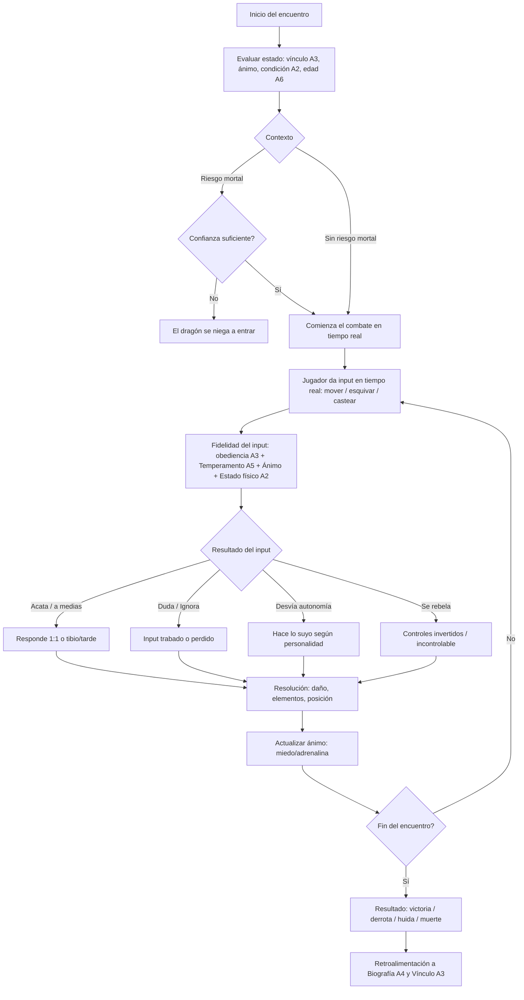

# A7 · Sistema de batalla (núcleo)
### Entregable de la iteración A7 (v1.0 · **Aprobado**) · *parte de* `Plan-de-Iteraciones.md`

> **Qué es esto:** *cómo* se pelea. Combate como **expresión del vínculo**, no como stat-check (pilar 1). Sigue subordinado a "vínculo > combate", pero es un sistema de primera. Define el **paradigma**, cómo entra la **obediencia imperfecta** en batalla, **elementos**, cómo la **personalidad** dicta estilo, y cómo la batalla **retroalimenta** biografía y vínculo. Incluye **diagrama de flujo de un encuentro**.
>
> **Depende de:** A2, A3, A5 (aprobados). **Hereda:** stat efectivo = expresado × condición × biografía × edad (A2); buckets de obediencia (A3); temperamento e Inteligencia dictan autonomía/estilo (A5); contextos práctica vs. a muerte (A1).

---

## Principio: controlás al dragón, pero el vínculo decide *cuán bien te responde*

**Tiempo real puro.** El jugador **sí** controla al dragón directamente (moverse, esquivar, castear poderes). Pero **la fidelidad de ese control depende del vínculo y del estado del dragón**: no manejás una máquina perfecta, manejás una criatura que **puede o no hacerte caso**. **El vínculo no filtra intenciones — es la calidad misma de los mandos.**

---

## Paradigma de combate *(resuelve D1)*

**Tiempo real puro, con fidelidad de control gobernada por Confianza/obediencia (A3) y estado del dragón (A2).**

- **Confianza muy alta ⇒ control 100% fiable:** el dragón hace exactamente lo que apretás.
- **Vínculo/obediencia bajos ⇒ el control falla en vivo.** Ejemplos:
  - Apretás **derecha** y **no dobla** (ignora), o **dobla tarde**.
  - **Controles invertidos** momentáneamente (desobediencia/rebeldía).
  - Duda: el input se **traba** un instante (ventana de castigo).
- **Estado físico débil (condición/edad, A2) ⇒ acciones recortadas**, sin importar el vínculo:
  - El **casteo** de un poder **dura menos** o carga más lento.
  - **Vuela poco** / el **sprint dura menos** / se queda sin aire antes.

Así, **entrenar el vínculo (A3) y mantener la condición (A2/pilar 4) son literalmente jugabilidad de combate**: definen si tus mandos responden. Un dragón poderoso mal vinculado o descuidado es **incontrolable en el peor momento**.

> Ventaja de este paradigma: la obediencia imperfecta se **siente en las manos** del jugador, no en un menú. Es la expresión más directa posible del pilar 1.

---

## Obediencia imperfecta = fidelidad de los mandos

Cada **input** del jugador pasa por el modelo de A3 y se resuelve como **qué tan fielmente responde el dragón** en ese instante:

```
input del jugador → obediencia(A3: Respeto, Confianza, Apego; Temperamento, Ánimo) → fidelidad del input
```

| Bucket (A3) | En la arena se siente como |
|---|---|
| **Acata pleno** | El input se ejecuta 1:1, con timing perfecto. |
| **Acata a medias** | Responde tibio/tarde: dobla lento, el poder sale débil. |
| **Duda** | El input se **traba** un instante — ventana de castigo. |
| **Ignora** | Apretás y **no pasa nada**; se pierde el comando. |
| **Desvía (autonomía)** | Hace **otra cosa** según temperamento (ataca solo, cubre, huye) en vez de tu input. |
| **Se rebela** | Extremos: **controles invertidos** o incontrolable (la *bomba de tiempo* de A3/A5). |

**Moduladores en vivo:**
- **Confianza** habilita el control fino y las acciones **riesgosas**: control 100% fiable exige Confianza muy alta; para un **PvP a muerte** directamente **se niega** a entrar si no confía (A3, atadura con permadeath de A1).
- **Ánimo** se mueve *durante* la pelea: herido → miedo ↑ (los mandos fallan más); racha a favor → adrenalina (más audaz, quizá se sobre-extiende ignorando tu "retirate").

---

## Personalidad → estilo de pelea *(de A5)*

El temperamento no es sabor: **dicta cómo pelea** y cuánto decide solo.

| Etiqueta (A5) | Estilo en arena | Riesgo |
|---|---|---|
| **Fiera** | Agresión constante, presiona sin parar | Se sobre-extiende, ignora "retirate" |
| **Cazador** | Oportunista, busca la apertura | Puede desviar para "cazar" en vez de seguir plan |
| **Protector** | Se interpone, prioriza cubrirte | Sacrifica ofensiva por defensa |
| **Lobo solitario** | Freelance eficaz, poca coordinación | Ignora intenciones que no comparte |
| **Tímido** | Cauto, cede terreno | Duda, puede intentar huir |
| **Compañero leal** | Coordinado, obediente | Menos explosivo/creativo |

- **Autonomía (A5):** define **cuánto actúa solo** sin input tuyo — auto-esquivar, auto-cubrirse, atacar por su cuenta. Alta = hace mucho solo (para bien o mal); baja = espera tus mandos (vulnerable si no reaccionás vos).
- **Inteligencia (A5, crece con edad + crianza + experiencia de combate):** no nace fija — **sube** peleando bien, criándolo bien y envejeciendo (A6). Habilita **habilidades defensivas** como el **esquive** y el **aguante**, y mejora la calidad de lo que hace por su cuenta. Los veteranos pelean por **astucia, no reflejos**.

### Habilidades emergentes por personalidad y atributos

El temperamento y los atributos **desbloquean habilidades**, unas **automáticas** y otras **casteables**:

| Origen | Habilidad | Tipo |
|---|---|---|
| Agilidad alta + Inteligencia | **Esquive** (dodge) | Automática o casteable |
| Inteligencia + experiencia | **Aguante** (encajar/tanquear un golpe) | Automática |
| Protector (A5) | **Cubrirse con el ala** / **desviar una bola de fuego** de un aliado | Automática/casteable |
| Tímido o con miedo (A5/ánimo) | **Alejarse del oponente** (retroceso) | Automática |
| Fiera / Cazador (A5) | Ofensivas de presión / golpe oportuno | Casteable |

> Estas habilidades **emergen de cómo criaste al dragón** (A5) y de sus atributos (A2), no de un árbol de skills elegido. Dos dragones distintos **pelean con kits distintos** sin que vos los hayas "comprado".

---

## Elementos *(núcleo; composición diferida)*

- Cada dragón tiene un **elemento base** heredado (A2). En A7 define **afinidad**: ventaja/desventaja básica frente a otros elementos (resistencias y debilidades) y coste/eficacia de sus ataques elementales.
- Las **combinaciones composicionales profundas** (mezclar elementos, reacciones complejas) **siguen fuera de alcance** — son del Track A' diferido. A7 asume **interacción elemental simple** (afinidad directa), suficiente para el núcleo y el MVP.

> **D2 resuelto:** para el núcleo/MVP va **afinidad simple** (ventaja/desventaja + resistencias por elemento base). La **composición** profunda (mezclas/reacciones) queda en el Track A' diferido.

---

## Retroalimentación: la batalla deja huella

El combate **no termina cuando termina** — escribe en las otras capas (pilares 1 y 2):

| Resultado del combate | → Biografía (A4) | → Vínculo (A3) |
|---|---|---|
| Peleó bien **a tu lado**, ganaron duro | Endurecimiento, "victoria peleada" | **Respeto ↑** |
| Lo **pusiste en peligro** grave / casi muere | Cicatriz + posible **trauma** (recelo/bloqueo) | **Confianza ↓** |
| Se lució protegiéndote | Recuerdo de hazaña | **Apego ↑** |
| Herida física | Cicatriz visual + modificador − | — |
| Lo forzaste a algo que salió muy mal | Trauma de capacidad (ataque bloqueado, A4) | Confianza ↓ |
| Derrota sin muerte (PvP práctica) | Registro; debilitado 24 h (A1) | Según cómo lo condujiste |

> Esto cierra el circuito del juego: **peleás con lo que criaste, y cómo peleás cambia lo que tenés.** Un dragón no es mejor por ganar: es **distinto** por haber peleado.

### Progresión por uso (skills que crecen con el estilo)

Las habilidades **mejoran usándolas**, y su uso **desbloquea movimientos nuevos**:
- Si abusás de la **movilidad**, mejoran las skills de movilidad y se **desbloquean maniobras** (mejores esquives, vuelos, dashes).
- Si abusás de un **tipo de poder**, ese poder se **refina** y habilita variantes.
- Esto se registra en la **biografía** (A4) como endurecimientos/desarrollos: el dragón **se especializa según cómo lo jugás**, sin un árbol de skills manual.

> Refuerza el pilar 2 (unicidad por biografía): el kit final de un dragón es huella de **cómo peleó toda su vida**, no de una build elegida en un menú.

---

## Contextos de combate

| Contexto | Muerte | Notas (de A1) |
|---|---|---|
| **Entrenamiento / PvE de práctica** | No | Sube stats/condición; genera biografía leve. |
| **PvP de práctica** | No | Apuesta con tope; perdedor debilitado 24 h. |
| **PvP a muerte** | **Sí (permadeath)** | Apuesta grande + bonus por matar; exige Confianza muy alta para entrar. |
| **PvE / amenazas** *(futuro)* | Depende | Contenido downstream, sujeto a la decisión de MVP. |

> **Estructura del mundo (aclarado en E1):** no hay mundo compartido por ahora. El jugador cría a su dragón en un espacio propio y entrena vía **minijuegos** (faucet de Monedas). El **PvP es pactado** (1v1/NvN, ambos consienten y arriesgan permadeath); las instancias son independientes salvo pelea acordada. Lobby/mapa compartido = futuro.

---

## Diagrama de flujo de un encuentro



---

## Alcance del MVP y el vehículo de "leveleo" *(resuelve D3)*

El MVP **no necesita el sistema de combate completo**. Alcanza con **algo mínimo** que muestre el hook, y hay flexibilidad sobre *qué* forma toma el entrenamiento/leveleo:

- **Opción A — Pelea básica:** un encuentro PvE mínimo en tiempo real, con la **fidelidad de control** visible (que se note cuando el dragón no obedece). Demuestra el hook directo.
- **Opción B — Sin batalla, leveleo por minijuego:** una forma alterna de **entrenamiento/leveleo** — p.ej. un **minijuego de plataformas de varios niveles** (buen encaje si el proyecto es **indie**) o un **farmeo tipo matar NPCs**. La obediencia imperfecta igual se expresa (los controles poco fiables hacen el plataformas más difícil con un dragón mal vinculado).

> **Resuelto:** el MVP puede arrancar con **cualquiera de las dos** (o ambas livianas). La **fidelidad de control** es el hook a demostrar sí o sí; el envoltorio (pelea vs. plataformas vs. farmeo) se elige al armar el backlog en **C1** según ambición/alcance indie. El **PvP y el "a muerte" quedan fuera del MVP**.

---

## Decisiones resueltas

- **D1 · Tiempo real puro + fidelidad de control:** controlás al dragón directo, pero el **vínculo (Confianza/obediencia) y el estado físico** definen cuán fiable es el control (inputs ignorados, invertidos, acciones recortadas). Confianza muy alta = control 100%.
- **D2 · Elementos → afinidad simple (mi decisión, "lo que consideres"):** ventaja/desventaja + resistencias por elemento base para el núcleo/MVP; la **composición** profunda queda en el Track A' diferido.
- **D3 · MVP flexible:** pelea básica **o** leveleo por minijuego (plataformas/farmeo); se decide en C1. El hook obligatorio es la fidelidad de control.

---

## Impactos aguas abajo (nuevos, por A7)

- **Nuevo sub-sistema — Habilidades y progresión por uso:** habilidades emergentes (esquive, aguante, cubrirse) + skills que crecen usándolas y desbloquean movimientos. Se registra en biografía (A4). Puede merecer su propio spec al detallar combate.
- **A5 (retro):** Inteligencia **crece** en juego (edad + crianza + experiencia de combate) y habilita esquive/aguante — no es solo un rango de nacimiento.
- **C1 (MVP):** elegir el vehículo de leveleo (pelea mínima / plataformas / farmeo NPCs); considerar alcance indie.
- **Track A' (diferido):** composición elemental.
- **B1 (spike):** el paradigma de tiempo real con control variable conviene tenerlo en cuenta al validar motor/estilo.

---

## Definición de Hecho (checklist de la compuerta)

- [x] Paradigma de combate definido (**tiempo real puro + fidelidad de control**).
- [x] Cómo entra la **obediencia imperfecta** en batalla (fidelidad de mandos + Confianza para riesgo mortal).
- [x] Cómo juegan los **elementos** (afinidad simple; composición diferida a A').
- [x] Cómo la **personalidad** dicta autonomía, estilo y **habilidades emergentes**.
- [x] Cómo la batalla **retroalimenta** biografía (cicatrices/desarrollos) y vínculo (respeto/confianza) + **progresión por uso**.
- [x] **Diagrama de flujo** de un encuentro.
- [x] Resueltas D1–D3 (tiempo real puro · afinidad simple · MVP flexible).
- [x] **Confirmado por vos** (aprobado 2026-07-02).
