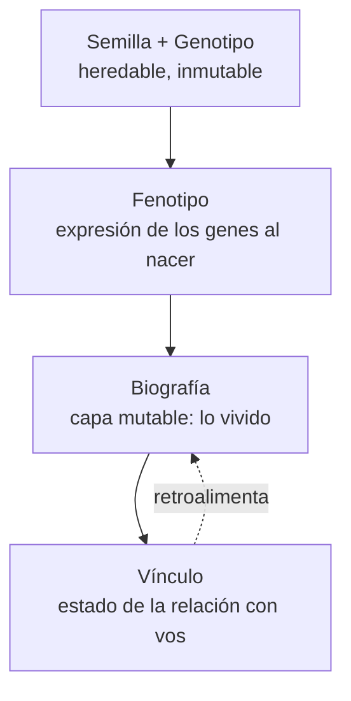

# Proyecto sin nombre — Juego de crianza y vínculo con dragones
### Documento de diseño conceptual (v0.1)

> **Tesis del proyecto:** no estás jugando a *tener* un dragón. Estás jugando a *criar a un individuo* que te elige, te recuerda, cambia con lo que viven juntos, y que —cuando lo pierdas— no vas a poder recuperar exactamente igual nunca más.
>
> El combate existe, pero es el **contexto** del vínculo, no el objetivo. La estrella del juego es la relación.

Este documento está pensado como material de trabajo: propone **varias direcciones**, marca ventajas/desventajas, y termina en decisiones concretas (motor, estilo, MVP, roadmap). Donde doy una recomendación fuerte, la marco como tal; el resto es menú para que elijas.

---

## 0. El problema de diseño central

Antes de las mecánicas, conviene nombrar la tensión que atraviesa todo el proyecto, porque casi todas las decisiones se derivan de ella:

**Querés dos cosas que normalmente se pelean entre sí.**

1. **Unicidad procedural** — que ningún dragón sea igual a otro, generados por sistemas.
2. **Vínculo emocional profundo** — que sientas que *ese* dragón es tuyo y perderlo duela.

El riesgo es que la generación procedural produzca "variedad sin significado" (mil dragones distintos que no te importan, como en un juego de gacha) y que el vínculo se sienta como una barra de "amistad" numérica que subís con caramelos.

La solución de diseño que propongo como columna vertebral —y que desarrollo en todo el doc— es esta:

> **La unicidad no debe venir principalmente del nacimiento (RNG), sino de la biografía (lo vivido).**

Dos dragones pueden nacer casi idénticos genéticamente. Lo que los vuelve irrepetibles es la cicatriz que se hizo defendiéndote, el ala que le quedó torcida tras una enfermedad, la manía que desarrolló porque lo criaste de noche, el hecho de que confía en vos porque estuviste. Eso no se puede recrear. Eso es lo que hace que perderlo duela.

Guardá esta frase, porque es el filtro para decir "sí" o "no" a cada feature: **¿esto hace que el dragón se sienta más como un individuo con historia, o solo agrega variedad estadística?**

---

## 1. Conceptos núcleo (varias propuestas)

Cuatro fantasías de jugador distintas. No son excluyentes del todo, pero cada una tira el juego hacia un lado. Elegí una como principal.

### Concepto A — "El Jinete" (vínculo negociado, estilo House of the Dragon)

La fantasía: no *poseés* a tu dragón, **te ganás su lealtad**. El dragón te elige (o no), puede desobedecerte, puede rechazarte si lo traicionás, y un dragón poderoso con poca confianza es más peligroso que útil. La relación es una negociación constante, no una barra que sube.

- **Ventajas:** es lo más fiel a tu inspiración principal y lo más original del mercado. La desobediencia y el "el dragón puede decir que no" es un mecanismo emocional potentísimo y poco explorado. El vínculo se vuelve *gameplay*, no decoración.
- **Desventajas:** el jugador puede frustrarse ("¿por qué mi dragón no me obedece?"). Requiere un tutorial emocional muy fino y feedback clarísimo de *por qué* el dragón reacciona así. Es la propuesta más difícil de balancear.

### Concepto B — "El Santuario" (guardián/criador de una especie)

La fantasía: sos el cuidador de un santuario/reserva donde criás, sanás y estudiás dragones. No sos un guerrero: sos casi un veterinario-naturalista. El foco es entender a cada individuo, cubrir sus necesidades, y verlos crecer y reproducirse a lo largo de generaciones.

- **Ventajas:** el estilo de vida "cuidar, observar, criar" es el más natural para priorizar vínculo sobre combate. Escala muy bien para solo-dev (loop de gestión, no de acción). Encaja con la fantasía Tamagotchi/Monster Rancher que buscás.
- **Desventajas:** riesgo de sentirse pasivo o "cozy sin tensión". Necesita una fuente de *stakes* (enfermedad, escasez, amenazas externas) para que importe.

### Concepto C — "El Linaje" (juego sobre generaciones, no sobre un dragón)

La fantasía: el protagonista real es una **estirpe** de dragones. Criás, cruzás, y tu progreso se mide en el árbol genealógico. Cada dragón individual vive, envejece y muere; lo que persiste es la sangre y lo que le enseñaste a la línea.

- **Ventajas:** convierte la muerte del dragón en parte del ciclo (no en game over), lo que es emocionalmente rico y comercialmente sostenible. La genética y la herencia dejan de ser un sistema secundario y pasan a ser *el* juego.
- **Desventajas:** puede diluir el vínculo con *un* dragón específico si no lo cuidás. Necesita mecánicas para que cada individuo importe antes de morir, no solo su ADN.

### Concepto D — "El Superviviente" (vos y tu dragón contra el mundo)

La fantasía: un dragón, un jugador, un mundo hostil. Dependés mutuamente para sobrevivir. Él te protege, vos lo curás y alimentás; la interdependencia genera el vínculo por necesidad, no por caricias.

- **Ventajas:** el vínculo emerge de la **codependencia bajo presión**, que es cómo se forman los vínculos reales. Tensión constante. Muy "una IP con identidad".
- **Desventajas:** el más pesado en producción (mundo, supervivencia, IA de combate). Riesgo de que el survival se coma al vínculo.

### 🎯 Recomendación de concepto

**Base: Concepto B (Santuario) como estructura + Concepto A (vínculo negociado) como corazón + Concepto C (linaje) como progresión de largo plazo.**

Es decir: un santuario donde criás individuos que tenés que *ganarte* (A), y donde la meta a largo plazo es la estirpe (C). El survival (D) queda como *modo/dificultad* opcional, no como base, por costo de producción.

Esto te da: un loop viable para solo-dev, el vínculo HotD que querés, y una razón para que la genética exista sin que la muerte sea game over.

---

## 2. El modelo del dragón — arquitectura técnica del individuo

Este es el sistema más importante del doc. Casi todos los temas que pediste (genética, cicatrices, dieta, clima, envejecimiento, enfermedades, afinidad, herencia, mutaciones) se organizan limpiamente en **cuatro capas**. Si implementás esto bien, el resto se cuelga de acá.

### Capa 0 — Semilla + Genotipo (heredable, casi inmutable)

Un número semilla + un **genoma** estructurado en "genes" discretos. Cada gen tiene alelos (variantes). Ejemplos de genes:

- Gen de **afinidad elemental primaria** y **secundaria** (fuego, hielo, tormenta, magma, vacío, naturaleza, cristal…).
- Gen de **potencial de tamaño** (define el rango, no el tamaño final).
- Genes de **morfología** (largo de cuello, forma de cuernos, número/forma de alas, tipo de cola, densidad de escamas…).
- Genes de **temperamento base** (tendencias, no personalidad final).
- Genes de **paleta** (color base, patrón, iridiscencia).
- **Genes recesivos y latentes** (no se expresan salvo condiciones — clave para las rarezas y mutaciones).

> La semilla garantiza reproducibilidad y ahorro de memoria (podés regenerar el aspecto a partir de la semilla + el genoma). El genotipo es lo que se **hereda** y lo que permite el árbol familiar.

### Capa 1 — Fenotipo (cómo se expresan los genes al nacer)

El genotipo no se muestra directo: se **expresa**. Un gen de "potencial de tamaño alto" con mala nutrición en la cría produce un dragón mediano. El fenotipo es la lectura de los genes filtrada por condiciones. Al nacer, esto define la apariencia inicial, el rango de tamaño posible, las tendencias de personalidad y las afinidades elementales manifiestas.

### Capa 2 — Biografía (la capa mutable — el alma del juego)

Aquí vive TODO lo que cambia con lo vivido. **Esta capa es la que hace único al dragón y la que no se puede heredar ni recrear.** Se acumula sobre el fenotipo:

- **Cicatrices permanentes** (con evento asociado: "recibida defendiéndote en la Cañada Helada, invierno del año 3").
- **Deriva por dieta** (color, tamaño, resistencia, incluso afinidad elemental leve).
- **Adaptación climática** (escamas más gruesas si lo criaste en frío; alas más grandes en altura).
- **Marcas de batalla** (musculatura, poses, agresividad aprendida).
- **Envejecimiento** (proporciones, opacidad de escamas, lentitud, sabiduría).
- **Secuelas de enfermedad** (ceguera parcial, cojera, patrón alterado).
- **Manías y quirks aprendidos** (comportamientos idiosincráticos según cómo lo criaste).

> Regla de oro: **cada entrada de la biografía debe tener un evento memorable asociado.** Nada cambia "por estadística invisible". Si una cicatriz aparece, el jugador vivió el momento en que se la hizo. Eso es lo que convierte un dato en un recuerdo.

### Capa 3 — Vínculo (el estado de la relación)

No es una barra de "amistad". Propongo modelarlo como **varios ejes independientes**, porque un vínculo real es multidimensional:

- **Confianza** — ¿cree que no lo vas a lastimar/abandonar? (se gana lento, se pierde rápido)
- **Respeto** — ¿te considera capaz/digno? (sube con logros compartidos, competencia)
- **Apego** — ¿le importás emocionalmente? (presencia, cuidado, tiempo)
- **Obediencia efectiva** = función de (confianza + respeto + estado de ánimo + personalidad), NO un valor propio.

Esto permite dragones con perfiles ricos: uno que te *quiere* pero no te *respeta* (cariñoso pero desobediente), uno que te *respeta* pero no confía (obediente pero distante), etc. Ahí aparece la profundidad emocional.

---

## 3. Los sistemas, uno por uno

Ahora bajo cada tema que pediste a mecánica concreta, apoyado en el modelo de 4 capas.

### 3.1 Generación procedural de dragones

Dos enfoques, elegí según ambición:

- **Enfoque "modular + shader" (recomendado para solo-dev):** el dragón se construye de **piezas 3D intercambiables** (juegos de cuernos, alas, colas, cabezas, tipos de escama) más **morph targets** (blendshapes) para estirar/engrosar/curvar, más **variación por shader** (tinte, iridiscencia, patrón, desgaste). Con ~6-10 piezas por slot y morphs continuos, el espacio de combinaciones es prácticamente infinito y visualmente coherente. Esto es lo que hace que la unicidad procedural sea **barata** en 3D.
- **Enfoque "generación de malla":** generar geometría por reglas (L-systems para cuernos, curvas para cuellos). Mucho más flexible, mucho más caro y riesgoso. Para más adelante, no para el prototipo.

> Insight clave para el resto del doc: **la unicidad visual procedural es casi gratis en 3D modular y carísima en 2D dibujado a mano.** Esta sola frase va a decidir tu estilo gráfico y tu motor (ver secciones 6 y 7).

### 3.2 Identidad visual muy marcada

Variedad no es identidad. Para que cada dragón sea *reconocible* (no solo distinto), necesitás **rasgos silueta-legibles**:

- Priorizá variación en la **silueta** (proporción, cuernos, alas, tamaño) por sobre la textura. Una silueta única se reconoce de lejos; un patrón de escamas no.
- **1-2 "rasgos firma"** por dragón: algo exagerado y memorable (un cuerno partido, una cresta enorme, un ojo de otro color, una cola bífida). El juego debería empujar un rasgo dominante en vez de promediar todo hacia el centro.
- **Nombre + llamado (voz) único:** generá el "grito" del dragón proceduralmente a partir de sus rasgos (tamaño → tono, elemento → timbre). Que suene distinto es la mitad de la identidad y es muchísimo más barato que arte.
- **Silueta + voz + rasgo firma** = identidad reconocible con costo bajo.

### 3.3 Sistema genético

Modelo mendeliano simplificado + capas de complejidad:

- Genes con **alelos dominantes/recesivos/latentes**.
- **Poligenia** para rasgos continuos (tamaño, color): varios genes suman, dando distribución "campana" — la mayoría medianos, pocos extremos. Esto es lo que hace que un dragón gigante sea *raro* y por lo tanto especial.
- **Latencia condicional:** genes que solo se expresan bajo condiciones (criado en el vacío, alimentado con X, nacido en tormenta). La base de las rarezas.
- **Carga genética / consanguinidad:** cruzar parientes cercanos aumenta la chance de expresar recesivos "malos" (fragilidad, enfermedad). Da profundidad al breeding y un dilema real: cruzás hermanos para fijar un rasgo hermoso, pero arriesgás salud. Decisión con peso.

### 3.4 Combinación de elementos

Dos filosofías, y te recomiendo la segunda:

- **Tabla fija (tipo Pokémon):** fuego, hielo, etc., con relaciones definidas a mano (fuego funde hielo, etc.). Seguro, legible, poco original.
- **Sistema composicional/reactivo (recomendado como identidad):** los elementos son **puntos en una rueda** y se combinan para producir *aspectos emergentes*:
  - fuego + tierra → **magma**
  - aire + agua → **tormenta**
  - hielo + fuego → **vapor / niebla**
  - naturaleza + cristal → **ámbar / bosque petrificado**
  - cualquier elemento + **vacío** → versión "consumidora/anti" (el vacío como anti-elemento que niega o absorbe)

  Un dragón tiene un elemento **primario**, uno **secundario** y a veces uno **latente**, y su combinación define no solo el combate sino su **apariencia, dieta, clima ideal y temperamento**. Un dragón magma busca calor y es territorial; uno de vacío es esquivo y se alimenta de energía, no de carne.

  - **Ventaja:** los elementos dejan de ser una etiqueta de combate y se vuelven **identidad integral** del individuo. Muy diferenciador.
  - **Desventaja:** más difícil de comunicar y balancear. Necesitás buen feedback visual de las reacciones.

### 3.5 Que dos dragones nunca sean iguales

Garantía por **composición de capas**, no por RNG bruto:

- Aunque dos dragones compartan genotipo (gemelos, clon), **divergen por biografía** (sección 2, capa 2). El fenotipo puede coincidir; la vida no.
- Técnicamente: la "huella" de un dragón = hash(genotipo + secuencia de eventos biográficos). Como la biografía es una secuencia temporal de eventos vividos por el jugador, la colisión es imposible en la práctica.
- **Y esto es el argumento emocional, no solo técnico:** tu dragón es único no porque el RNG lo hizo raro, sino porque *vos estuviste ahí para cada cosa que le pasó*. Nadie más tiene ese dragón porque nadie más vivió esa historia.

### 3.6 Personalidades

Modelo de **ejes de temperamento** (no etiquetas fijas), definidos por genes base + moldeados por crianza:

- Ejes propuestos (continuos, -100 a +100): Audacia↔Cautela, Agresión↔Docilidad, Sociabilidad↔Independencia, Orgullo↔Sumisión, Curiosidad↔Rutina, Territorialidad.
- Las "etiquetas" que pediste (agresivo, protector, orgulloso, tímido, territorial, curioso) **emergen** de combinaciones de ejes. Protector = alta agresión + alto apego. Tímido = alta cautela + baja sociabilidad. Esto evita el sistema de "clases de personalidad" fijas y hace que cada dragón caiga en un punto único del espacio.
- La personalidad afecta: qué acciones sube el vínculo, cómo reacciona a otros dragones, su estilo de combate, y qué comandos obedece más fácil.

### 3.7 Cómo influye la crianza en el comportamiento

El puente entre genes y comportamiento final. La crianza **desplaza los ejes** dentro de un rango permitido por la genética (naturaleza pone el rango, crianza pone el punto):

- Criar con **firmeza vs. permisividad**, **presencia vs. ausencia**, **recompensa vs. corrección** empuja los ejes.
- **Ventanas de desarrollo:** hay una etapa temprana (cría) donde la personalidad es maleable; después se "fija" y cuesta muchísimo cambiarla. Esto crea decisiones con consecuencias reales y hace que la etapa de cría se sienta importante.
- Las **manías/quirks** nacen acá: criarlo de noche → nocturno; alimentarlo a mano siempre → dependiente; dejarlo pelear joven → agresivo por defecto.

### 3.8 Evoluciones físicas

No al estilo "evoluciona en X a nivel 16". Propongo **crecimiento continuo + hitos morfológicos**:

- El dragón **crece de forma continua** (escala, morphs) con el tiempo y la nutrición.
- **Hitos** (metamorfosis) en momentos clave del ciclo de vida (cría → juvenil → adulto → anciano) donde cambia proporciones y desbloquea rasgos. La *forma* del hito depende de la biografía: un juvenil muy peleador desarrolla musculatura y placas; uno criado en frío desarrolla pelaje/escamas gruesas.
- Ramificación por vida vivida, no por "elegir evolución". Esto refuerza que el dragón es producto de *su* historia.

### 3.9 Cicatrices permanentes

Uno de tus sistemas emocionales más fuertes. Implementación:

- Se aplican como **decals/máscaras sobre la textura** + posible deformación de malla (ala rasgada, cuerno partido).
- **Cada cicatriz guarda su evento** (fecha in-game, causa, contra qué). El jugador puede inspeccionar y leer la historia de las marcas → convierte el cuerpo del dragón en un diario.
- Nunca se borran (o solo con un recurso rarísimo, para preservar el peso). La irreversibilidad es lo que las hace importar.

### 3.10 Cambios según alimentación

La dieta modifica la capa biografía:

- **Ejes de dieta:** carnívoro/herbívoro, mineral, energético (para elementales como cristal/vacío).
- Efectos: tamaño, color/brillo, resistencias, salud, y **deriva elemental leve** (alimentarlo con minerales ígneos empuja hacia fuego/magma).
- **Malnutrición** deja marcas permanentes (menor tamaño del potencial, fragilidad). Sobrealimentación tiene sus propios costos. Alimentar bien es cuidado activo, no un menú trivial.

### 3.11 Cambios según el clima

El ambiente de crianza esculpe al dragón:

- Frío → escamas/plumaje denso, mayor masa. Calor → estilizado, alas mayores para disipar. Altura → alas grandes. Vacío/oscuridad → ojos grandes, palidez.
- Esto hace que **dónde** criás sea una decisión de diseño del individuo. Enlaza con el city-builder/santuario: construir biomas es literalmente esculpir a tus dragones.

### 3.12 Cambios según las batallas

Pelear deja huella (física y psicológica):

- Físico: musculatura, cicatrices, desgaste.
- Psicológico: sube agresión, puede subir respeto (si peleó bien a tu lado) o bajar confianza (si lo pusiste en peligro innecesario). **Sobre-exponerlo al combate lo endurece pero lo aleja emocionalmente.** Tensión de diseño hermosa: el dragón fuerte de guerra puede ser el que menos te quiere.

### 3.13 Envejecimiento

Ciclo de vida completo, tratado como arco narrativo, no como decadencia molesta:

- Etapas: cría → juvenil → adulto → anciano. Cada una cambia apariencia, capacidades y comportamiento.
- **La vejez tiene ganancias, no solo pérdidas:** el anciano pierde velocidad/vigor pero gana vínculo profundo, obediencia, sabiduría (bonos únicos, quizás capacidad de "enseñar" a crías). Esto evita que envejecer se sienta como castigo.
- La muerte por vejez es un **evento diseñado**, con antelación y despedida (ver sección 4). No un game over súbito.

### 3.14 Tamaño

- Definido por gen de potencial (poligénico → mayoría medianos) filtrado por nutrición, salud y edad.
- El tamaño es **funcional**: afecta qué puede cargar, dónde entra, cómo pelea, cuánto come. Un dragón colosal es impresionante pero caro de mantener y difícil de alojar → decisión, no solo un número más grande.
- Tamaños extremos (gigante/enano) = rareza deseable.

### 3.15 Rarezas

Estratos de rareza que emergen de los sistemas, no tabla de "shiny":

- Combinaciones elementales infrecuentes, rasgos firma extremos, colores por recesivos latentes, tamaños de cola de distribución.
- **Rareza ganada:** un dragón anciano con 20 cicatrices y máxima confianza es "raro" porque nadie más tiene *ese*. Este es el tipo de rareza que querés promover por encima de la rareza de nacimiento.

### 3.16 Enfermedades

Fuente de *stakes* para que el santuario cozy tenga tensión:

- Enfermedades con causas (mala dieta, clima equivocado, hacinamiento, consanguinidad, heridas no tratadas) y síntomas observables.
- **Contagio** entre dragones cercanos → decisiones de cuarentena, presión de gestión.
- Curar bien → refuerza vínculo (te cuidó cuando estuviste mal). Curar mal o tarde → secuelas permanentes (biografía) o muerte. La enfermedad es donde el cuidado se vuelve dramático.

### 3.17 Afinidad con el jugador

Ya cubierto en la capa Vínculo (2.3): confianza/respeto/apego → obediencia efectiva. Puntos clave:

- Se gana con **acciones significativas repetidas** (presencia, cuidado en crisis, logros compartidos), no comprando cariño con ítems.
- Es **asimétrica**: fácil de romper, difícil de reconstruir. Un acto de abandono o de ponerlo en peligro puede tirar meses de confianza.
- **Se muestra en comportamiento, no en números:** un dragón con alto apego te busca, se acurruca, reacciona a tu llegada. Uno con bajo apego te ignora. El jugador *lee* la relación en el cuerpo del dragón, no en una barra.

### 3.18 Reproducción y herencia genética

Corazón del Concepto C (linaje):

- Cruzás dos dragones → la cría hereda genotipo (mezcla mendeliana + poligénica de los padres) pero **nace con biografía vacía**. Hereda el potencial, no la historia.
- **Esto es deliberado y es el punto emocional:** podés criar al hijo de tu dragón perdido, y se le va a *parecer*, pero **no es él** — no tiene sus cicatrices, sus recuerdos, su vínculo con vos. La herencia consuela pero no reemplaza. Ese matiz es oro para el vínculo.
- Impronta de crianza: rasgos aprendidos (no genéticos) pueden "enseñarse" del padre a la cría si conviven → forma de que un legado de comportamiento persista.

### 3.19 Árboles familiares de dragones

- Registro genealógico navegable: linajes, rasgos que se fijan a lo largo de generaciones, dragones "fundadores".
- Herramienta de gameplay (planificás cruces mirando el árbol) **y** de emoción (ves el lugar de tu primer dragón como raíz de todo lo que vino después). Memorial + estrategia en la misma pantalla.
- Marca consanguinidad visualmente para el sistema de carga genética (3.3).

### 3.20 Mutaciones extremadamente raras

El techo de la fantasía de "un dragón único en el mundo":

- Mutaciones = expresión de genes latentes bajo condiciones extremas + tirada rarísima. Producen rasgos fuera de la distribución normal (un elemento nuevo, una morfología imposible, cromática irreal).
- **Condicionadas por juego, no solo por suerte:** una mutación de vacío podría requerir criar en una zona específica durante un evento climático raro. Esto hace que las mutaciones sean *logros perseguibles*, no lotería pura — más satisfactorias y más "historia que contar".
- Deben ser lo bastante raras como para ser leyenda entre jugadores (base de comunidad y de la IP).

---

## 4. El sistema emocional — hacer que perderlo duela

Esto es lo que pediste priorizar sobre el combate, así que le doy peso propio. El vínculo no es *un* sistema; es una propiedad que emerge de varios. Mecánicas concretas:

**El dragón te elige (impronta).** Al principio no es tuyo por defecto: hay un período de impronta donde *se decide* si te acepta. Ganártelo desde el minuto uno lo vuelve *tuyo* en un sentido que un ítem comprado nunca es.

**Obediencia imperfecta (lo más importante).** Los comandos **no siempre funcionan**: su éxito depende de confianza + respeto + ánimo + personalidad. Un dragón que te obedece porque *quiere* se siente radicalmente distinto de uno que te obedece porque el juego lo obliga. La desobediencia no es un bug: es la prueba de que es un ser con voluntad. (Inspiración directa HotD.)

**Memoria.** El dragón recuerda eventos específicos y los referencia en su comportamiento: te salvó una vez → más protector; lo abandonaste una temporada → desconfía al volver; sobrevivieron juntos a algo → apego alto. La memoria hace que el pasado compartido *importe en el presente*.

**Presencia y ausencia.** Reacciona a que te vayas y vuelvas. Ausencias largas tienen costo emocional (y a veces físico). Esto hace que *el tiempo que le dedicás* sea la moneda real del vínculo, no los ítems.

**El cuerpo como diario.** Cicatrices, marcas, canas, poses: podés "leer" toda la vida del dragón en su cuerpo. Cada marca abre su recuerdo. El dragón *es* la historia de ustedes hecha carne.

**Irremplazabilidad.** Cuando muere (vejez, enfermedad, batalla), **no se puede recrear**. Podés criar a su descendiente (3.18), que carga su sangre pero no su historia. El juego nunca te devuelve *ese* dragón. Esa es la fuente del duelo, y es sana: un vínculo que no puede perderse no vale nada.

**Despedida diseñada.** La muerte por vejez se anuncia (el dragón envejece visiblemente, baja actividad), dándote tiempo de "últimos momentos". Al morir: un ritual/memorial, su lugar en el árbol genealógico, quizás una cría final. La pérdida se transforma en legado, no en pantalla de derrota.

**Permadeath modulada.** Ofrecé la muerte permanente como el modo por defecto o como dificultad. La posibilidad real de perderlo es lo que carga de tensión cada decisión de combate/cuidado. (Dejá un modo más suave para quien no lo banque — pero el modo "canon" debería tener stakes reales.)

> Test de éxito del proyecto: en un playtest, cuando el dragón se hace su **primera cicatriz** o **desobedece por primera vez**, ¿el jugador reacciona emocionalmente (un "¡no!", una pausa)? Si sí, el corazón del juego funciona. Ese es el momento que tenés que lograr en el MVP.

---

## 5. Estilos de juego — cómo afecta cada uno y viabilidad solo-dev

| Estilo | Cómo afecta al proyecto | Sirve al vínculo | Costo solo-dev | Veredicto |
|---|---|---|---|---|
| **Simulador de crianza** | Loop diario de cuidado/observación; núcleo Tamagotchi-en-3D. | ★★★★★ | Bajo | **Base ideal.** |
| **Gestión de santuario** | Construís biomas, gestionás población, recursos, salud. | ★★★★★ | Medio | **Capa perfecta encima del sim.** |
| **RPG** | Progresión, historia, misiones, mundo con lore. | ★★★★ | Alto | Bueno como capa narrativa; caro entero. |
| **Roguelite** | Corridas procedurales; justifica permadeath y gen procedural. | ★★☆ | Bajo-Medio | Tira contra el vínculo a largo plazo (corridas cortas ≠ criar por años). Interesante como *modo*, no como base. |
| **Survival** | Recursos, hambre, amenazas; interdependencia. | ★★★★ | Alto | Gran generador de vínculo (Concepto D) pero pesado. Mejor como modo/dificultad. |
| **City Builder** | Construir/gestionar el hábitat. | ★★★ | Medio | Se solapa con santuario; útil como sub-sistema. |
| **Mundo abierto** | Exploración libre, escala grande. | ★★★ | **Muy alto** | **Trampa clásica de solo-dev.** Evitar en el prototipo. |
| **Multiplayer** | Interacción entre jugadores. | ★★ | Muy alto (infra) | Post-lanzamiento, no antes. |
| **Cooperativo** | Criar/explorar con otro. | ★★★ | Alto | Bonito pero caro; fase tardía. |
| **PvE** | Dragones vs. mundo/amenazas. | ★★★★ | Medio | Sí — el combate como contexto del vínculo. |
| **PvP** | Dragones de jugadores enfrentados. | ★☆ | Alto (balance) | Riesgo: empuja hacia el min-maxeo y contra el apego. Endgame opcional, con cuidado. |

### 🎯 Recomendación de estilo

**Simulador de crianza + gestión de santuario, single-player, con PvE ligero como fuente de tensión.** Es lo más viable para una persona *y* lo que mejor sirve a tu prioridad de vínculo. El resto (survival, RPG, coop, PvP) son capas o modos que agregás después si el núcleo funciona.

Sobre PvP en particular: cuidado. El PvP competitivo casi siempre convierte a las criaturas en *builds* optimizadas y mata el apego (nadie llora por perder un stat-stick). Si algún día lo hacés, que sea "amistoso/exhibición", no ranked con meta.

---

## 6. Estilos gráficos — comparación de costo

Recordá el insight de 3.1: **tu pilar de "dragones únicos proceduralmente" favorece brutalmente el 3D modular sobre el 2D dibujado a mano.** Cada combinación en 2D pintado requiere arte nuevo; en 3D modular la combinación es casi gratis.

| Estilo | Costo solo-dev | Compatibilidad con dragones procedurales | Nota |
|---|---|---|---|
| **Low Poly (3D)** | **Bajo** | ★★★★★ | Modular + shader = unicidad casi gratis. Estética con identidad. **Top pick.** |
| **Stylized (3D)** | Medio | ★★★★★ | Igual de compatible, más "producción" que low poly. Excelente si tenés algo de músculo artístico. |
| **Cel Shading (3D)** | Medio | ★★★★ | Shader encima de 3D modular; look de anime/ilustración. Muy vendible, costo controlable. |
| **2.5D** | Medio | ★★★ | Sprites/planos en espacio 3D. La variación procedural se complica (vuelve a necesitar arte por combinación). |
| **Isométrico** | Medio | ★★★ | Bueno para gestión/santuario; la unicidad del dragón sufre si es 2D. |
| **Pixel Art** | Medio-Alto* | ★☆ | *Barato de empezar, **carísimo de escalar con generación procedural**: cada rasgo × animación = frames a mano. Pelea contra tu pilar central. |
| **Hand Painted** | Alto | ★★ | Precioso, insostenible para variación procedural en solo-dev. |
| **Semi Realista** | **Muy alto** | ★★ | Descarta para solo-dev/prototipo. Escala de estudio. |

### 🎯 Recomendación de estilo gráfico

**Low Poly o Stylized 3D con cel shading opcional**, construido sobre **piezas modulares + morph targets + variación por shader**. Es el único enfoque donde "que dos dragones nunca sean iguales" se logra **sin arte infinito**. Cualquier estilo 2D dibujado a mano (pixel, hand painted) es una contradicción directa con tu pilar de unicidad procedural para una sola persona.

---

## 7. Motores — Godot vs Unity vs Unreal

Objetivo declarado: **una sola persona, prototipo en menos de un año.** Con eso como filtro:

| Motor | A favor | En contra | Para tu caso |
|---|---|---|---|
| **Godot 4** | Gratis, sin royalties, liviano, iteración rapidísima, 3D suficientemente bueno para estilizado, GDScript productivo + C#, ideal para solo-dev. | Ecosistema de assets más chico; 3D no es AAA (no lo necesitás). | **Recomendado.** Encaja perfecto con estilizado/low-poly y prototipado rápido en solitario. |
| **Unity** | Asset Store enorme (te ahorra meses: controladores, herramientas procedurales, shaders), muchísimos tutoriales, C# maduro, 3D estilizado sobradísimo. | Historia de licencias volátil; más "peso" que Godot. | **Alternativa pragmática** si querés atajos del Asset Store o priorizás cantidad de recursos de aprendizaje. |
| **Unreal 5** | Fidelidad y herramientas AAA, Blueprints. | **Sobredimensionado** para un sim estilizado; pesado para solo-dev; su fuerte (fotorrealismo) es justo lo que NO buscás. | No para este proyecto/prototipo. |

### 🎯 Recomendación de motor

**Godot 4** si valorás iteración rápida, cero royalties y un stack liviano manejable por una persona. **Unity** si querés apoyarte fuerte en el Asset Store para acelerar. **Unreal, no** para este perfil: su ventaja es el realismo, que es contrario a tu estilo y a tu escala. Para "una persona, prototipo en <1 año, estilizado", **elegiría Godot 4.**

---

## 8. MVP — 6 meses

El MVP tiene **una sola misión: probar que el vínculo se siente real y que criar es divertido.** No prueba variedad, ni breeding, ni combate profundo. Prueba el corazón.

**El MVP debe demostrar este momento:** un jugador cuida a *un* dragón durante una sesión, y cuando el dragón se hace su primera cicatriz o lo desobedece por primera vez, *le importa*.

### Incluye (lo indispensable)
- **Un solo dragón** (o elegir entre 3 huevos con genética visible) — no roster.
- **Un espacio** (un recinto de santuario simple), un solo bioma.
- **Generación visual básica funcionando:** 3D modular + shader, ~2-3 elementos, variación real entre los 3 huevos. Prueba el pilar de unicidad a escala mínima.
- **Loop diario de cuidado (Tamagotchi-3D):** alimentar, interactuar, jugar, atender necesidades, con el dragón **expresivo** (reacciona con el cuerpo).
- **Sistema de vínculo con obediencia imperfecta:** confianza/apego que suben con cuidado y bajan con negligencia; comandos que fallan si el vínculo es bajo. **Este es el sistema estrella del MVP.**
- **Una fuente de stakes:** puede enfermarse o herirse, y **cicatrizar permanentemente** — con evento y recuerdo asociado. Idealmente, puede **perderse**.
- **Un beat de cambio físico:** crecimiento acelerado o un hito de evolución, para *ver* que el dragón cambia con lo vivido.
- **Naming + un llamado/voz** propio.

### NO incluye (guardar para después)
Breeding, genética heredada, árbol familiar, PvP, multiplayer, mundo abierto, roster grande, todos los elementos, ciudad/economía compleja, narrativa extensa.

### Criterio de éxito del MVP
No es "cuánto contenido". Es: en playtests ciegos, **¿los jugadores reaccionan emocionalmente a la primera cicatriz / primera desobediencia / primer signo de apego?** Si sí, tenés IP. Si no, ningún contenido lo va a salvar y hay que iterar el núcleo antes de escalar.

---

## 9. Roadmap — de MVP a juego comercial

**Fase 0 — Prototipo / MVP (meses 0-6).** Lo de arriba. Meta: validar el vínculo. Gate: si el momento emocional no aparece, *no* avanzar; iterar el núcleo.

**Fase 1 — Vertical slice jugable (meses 6-10).** Roster real (varios dragones a la vez), sistema de personalidad completo (ejes), 2-3 biomas con efecto climático real sobre la morfología, dieta con consecuencias, ciclo de vida completo (incluida la muerte diseñada y el memorial). Meta: que criar *a lo largo del tiempo* enganche.

**Fase 2 — Genética y linaje (meses 10-15).** Reproducción, herencia mendeliana + poligénica, consanguinidad/carga genética, árbol familiar navegable, primeras mutaciones raras condicionadas. Meta: activar el bucle de largo plazo (Concepto C) y la rejugabilidad.

**Fase 3 — Sistema elemental composicional + PvE (meses 15-20).** Rueda de elementos completa con aspectos emergentes, combate PvE como contexto del vínculo (no como foco), amenazas al santuario que dan stakes. Meta: profundidad de sistemas + tensión sostenida.

**Fase 4 — Early Access (mes ~20).** Salís con núcleo + genética + linaje + PvE. Comunidad empieza a compartir dragones/mutaciones raras → marketing orgánico y base de IP. Iterás con feedback real.

**Fase 5 — 1.0 y más allá.** Pulido, endgame, más biomas/elementos/mutaciones, y *ahí sí*, evaluás capas sociales: intercambio de crías entre jugadores, visitas de santuario, coop, y —con mucho cuidado— exhibición PvP amistosa. Todo **encima** del single-player, nunca reemplazándolo.

### Principio que atraviesa todo el roadmap
En cada fase, la pregunta de corte es la de la sección 0: **¿esto hace que el dragón se sienta más como un individuo con historia, o solo agrega variedad/contenido?** Si es lo segundo, va al fondo de la lista. El single-player de crianza es la columna vertebral en las cinco fases; todo lo demás cuelga de ahí.

---

## Resumen de decisiones (TL;DR)

- **Concepto:** Santuario (estructura) + vínculo negociado estilo HotD (corazón) + linaje (largo plazo).
- **Tesis:** la unicidad viene de la **biografía vivida**, no del RNG de nacimiento. Por eso perderlo duele.
- **Arquitectura del dragón:** 4 capas — Genotipo → Fenotipo → **Biografía (el alma)** → Vínculo.
- **Vínculo:** confianza/respeto/apego → **obediencia imperfecta**. El dragón te elige y puede rechazarte.
- **Estilo de juego:** sim de crianza + gestión de santuario, single-player, PvE ligero. Evitar mundo abierto/MMO en el prototipo.
- **Gráficos:** Low Poly / Stylized 3D modular + shader. Nada de 2D pintado a mano (contradice la unicidad procedural).
- **Motor:** **Godot 4** para una persona / prototipo en <1 año (Unity como alternativa pragmática por su Asset Store).
- **MVP (6 meses):** un dragón, un recinto, cuidado diario, obediencia imperfecta, primera cicatriz permanente, posibilidad de pérdida. Éxito = el jugador reacciona emocionalmente.
- **Roadmap:** MVP → vertical slice → genética/linaje → elementos+PvE → Early Access → 1.0 + social.
